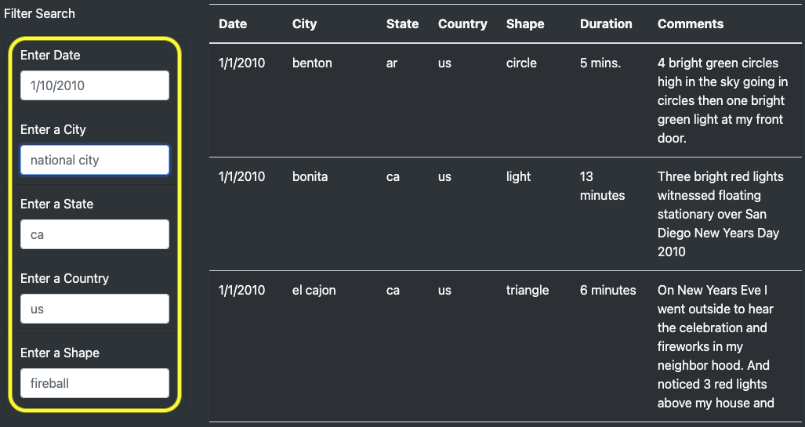
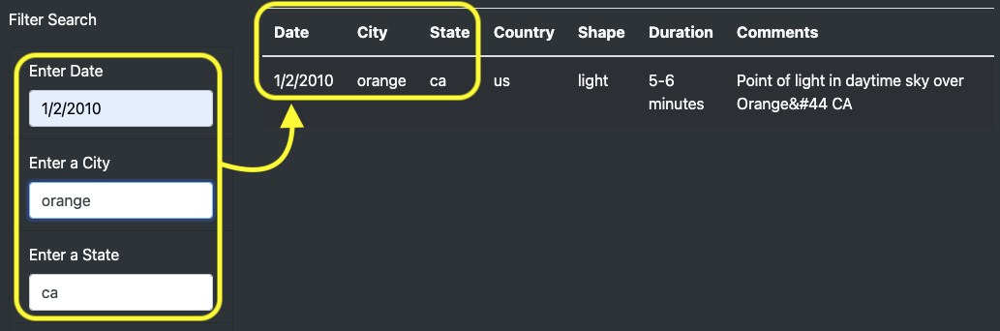
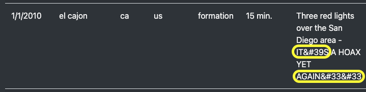

# UFOs
Use of JavaScript, HTML, and CSS to create a custom webpage that showcases different UFO sightings around the world.

### Overview

Dana a data journalist created a webpage and dynamic table and are working as intended, but she’d like to provide a more in-depth analysis of UFO sightings by allowing users to filter for multiple criteria at the same time. Therefore, the challenge in this module was to add table filters for the city, state, country, and shape.

### Results

On the webpage, see index.html file link below in this repository:

https://github.com/jsaltmd/UFOs/blob/main/index.html

The table can be filtered based on any or all of the following criteria: Date, City, State , Country, or Shape. See image (picture A) shown below:

Picture A:

When the user enter a search criteria, the javascript we write will store the values in the text box and IDs associated with the text box and the javascript object. Therefore, when the user type in "ca" for the state, the table will show all the information related to "ca". The user can also perform multiple search and it will filter the table accordingly as shown on the image below (picture B):

Picture B:

### Summary

One drawback of this new design is that, it does not have the additional filters for the given information in the table:

* Duration
* Comments

And I would like to see some animation and add some hint of colors to make it visually appealing and to fully make use of the bootstrap features.

In addition, I would also recommend the following:

1. *Create a code to correct some of the errors on the data, refer to image (picture C) shown below:*

Picture C:

 2. *Add a pull down menu for some of the filter search criteria to directly provide the given information from the table to the user. A good example is the "shape" criteria. Some of the shapes are uncommon (e.g. light, flash, chevron, formation, etc.). The user will have the tendency to scroll through the table and it is not efficient. Refer to image (picture D) shown below:

Picture D:

